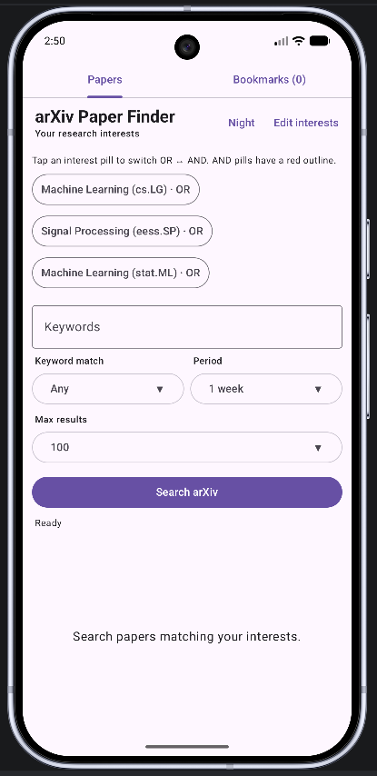

# arXiv Paper Finder

A lightweight Android app for discovering recent arXiv research papers based on your interests, keywords, subject areas, and time range.

The app is designed to make arXiv browsing faster and more focused, especially when you regularly follow multiple research areas.

🌐 App page:  
https://sameerhansda.github.io/arxiv-paper-finder/

---

## Features

- Personalized research interests
- Broad subject selection followed by sub-area selection
- Persistent interest profile
- Per-interest AND / OR logic
- Keyword search across paper titles and abstracts
- `Any` / `All` keyword matching
- Time filters:
  - 1 day
  - 1 week
  - 1 month
- Adjustable maximum number of results
- Local bookmarks
- Dedicated Bookmarks tab
- Author and affiliation information when available from arXiv
- In-app arXiv reader
- Experimental arXiv HTML support
- HTML button automatically disabled when no HTML version is available
- Light and Night modes
- Dark styling for supported arXiv HTML pages
- Search settings and results preserved while switching tabs
- Collapsible search controls while scrolling
- Export bookmarks now — saves a portable .json file using Android's file picker.
- Import bookmarks — imports bookmarks from another device. Imported bookmarks are merged with existing ones rather than replacing them.
- Enable weekly backup — choose a folder once, and Android WorkManager automatically updates arxiv-bookmarks-latest.json every 7 days.
- Change weekly backup folder
- Disable weekly backup

---

## Interest Filtering

Instead of forcing users to work directly with arXiv category codes, the app starts with broader research areas such as:

- Computer Science
- Electrical Engineering
- Physics
- Mathematics
- Statistics
- Biology
- Economics
- Quantitative Finance

Users can then select more specific subfields such as:

- Machine Learning
- Signal Processing
- Computer Vision
- Quantum Physics
- Probability
- Optimization
- Audio and Speech Processing
- Image and Video Processing
- Robotics
- NLP

The corresponding arXiv category codes are handled automatically by the app.

---

## AND / OR Interest Logic

Each selected research-interest pill can independently be toggled between `OR` and `AND`.

By default, interests are treated as `OR`.

For example:

```text
Signal Processing      AND
Machine Learning       OR
Computer Vision        OR
Quantum Physics        OR
```

is interpreted as:

```text
Signal Processing
AND
(
    Machine Learning
    OR Computer Vision
    OR Quantum Physics
)
```

Internally this becomes an arXiv query similar to:

```text
cat:eess.SP AND
(
    cat:cs.LG
    OR cat:cs.CV
    OR cat:quant-ph
)
```

This allows much more flexible filtering than a simple global AND/OR switch.

---

## Keyword Search

Keywords are applied directly in the arXiv API query before the result limit is applied.

For example:

```text
diffusion
```

searches both the title and abstract:

```text
ti:diffusion OR abs:diffusion
```

For multiple comma-separated keywords:

```text
diffusion, beamforming
```

### Any

```text
(ti:diffusion OR abs:diffusion)
OR
(ti:beamforming OR abs:beamforming)
```

### All

```text
(ti:diffusion OR abs:diffusion)
AND
(ti:beamforming OR abs:beamforming)
```

This avoids incorrect results that can occur when keyword filtering is performed only after downloading a limited number of papers.

---

## Paper Details

Tapping a paper opens a detail sheet containing:

- title
- publication date
- arXiv ID
- categories
- authors
- author affiliations when supplied by arXiv
- abstract

From there, the user can open either:

### Go to arXiv

Opens the standard arXiv paper page inside the app.

### View HTML

If arXiv provides an experimental HTML version of the paper, the app enables the **View HTML** button.

If no HTML version exists, the button remains disabled.

The HTML page is displayed using an in-app WebView instead of launching an external browser.

---

## Bookmarks

Papers can be bookmarked directly from the paper list.

Bookmarks are stored locally on the device and remain available after restarting the app.

A dedicated **Bookmarks** tab allows saved papers to be revisited without searching again.

---

## Night Mode

The app supports both Light and Night modes.

Night mode applies to:

- app interface
- paper cards
- search controls
- tabs
- bottom sheets
- in-app WebView

For arXiv HTML pages, the app additionally injects a dark stylesheet so the paper itself can be displayed with:

- dark background
- light text
- readable links
- dark code blocks
- preserved figures and plots

---

## Search State

Search settings remain intact when switching between the **Papers** and **Bookmarks** tabs.

The following are preserved:

- keywords
- Any / All setting
- period
- maximum results
- current paper results
- AND / OR interest states
- scroll position

---

## Download

The Android APK can be downloaded from:

**https://sameerhansda.github.io/arxiv-paper-finder/**

After downloading, Android may ask you to allow installation from your browser or file manager.

---

## Requirements

- Android 8.0 or newer
- Internet connection for querying arXiv and reading papers

---

## Technology

The app is built using:

- Kotlin
- Jetpack Compose
- Material 3
- Android WebView
- AndroidX WebKit
- arXiv API
- XML / Atom feed parsing
- SharedPreferences for local settings and bookmarks

The application communicates directly with arXiv and does not require a separate backend server.

---

## Privacy

The app does not require an account.

Research interests, bookmarks, display preferences, and search settings are stored locally on the Android device.

The app sends search requests directly to arXiv when the user performs a search.

---

## Screenshots

You can add screenshots to the repository and display them here using:

```markdown

```

---

## Building from Source

Clone the repository:

```bash
git clone https://github.com/sameerhansda/arxiv-paper-finder.git
```

Open the project in Android Studio.

Allow Gradle synchronization to complete, then build the debug APK using:

```text
Build
→ Build Bundle(s) / APK(s)
→ Build APK(s)
```

The APK will normally be generated at:

```text
app/build/outputs/apk/debug/app-debug.apk
```

For a signed release build:

```text
Build
→ Generate Signed Bundle / APK
→ APK
```

Use the same signing keystore for future releases so Android can install newer versions as updates.

---

## Disclaimer

This is an independent research-discovery application and is not an official arXiv application.

arXiv is a registered trademark of Cornell University.

Paper metadata and content are obtained from arXiv.

---

## License

Add the license you intend to use for the source code here.

For example, if using the MIT License:

```text
MIT License
```

and include a `LICENSE` file in the repository.

---

## Feedback and Contributions

Bug reports, feature suggestions, and contributions are welcome through GitHub Issues and Pull Requests.

If you find the app useful, consider starring the repository.
